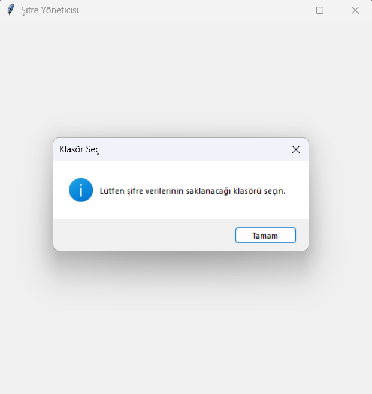
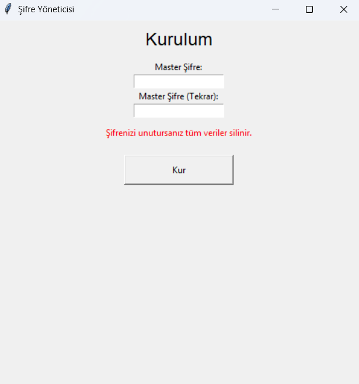
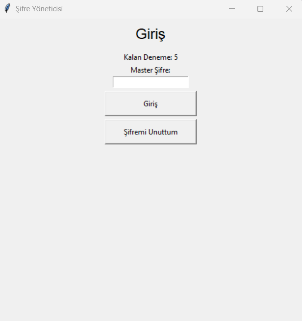
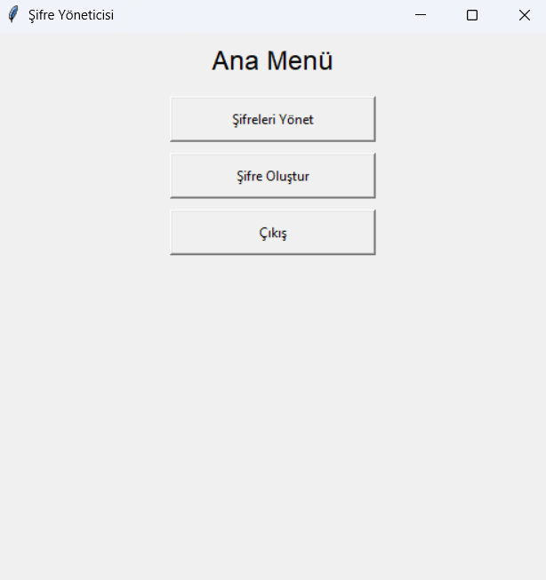
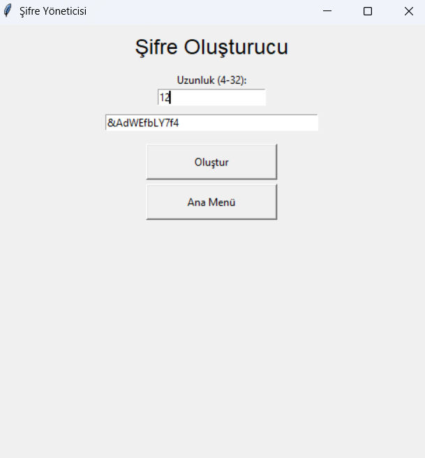
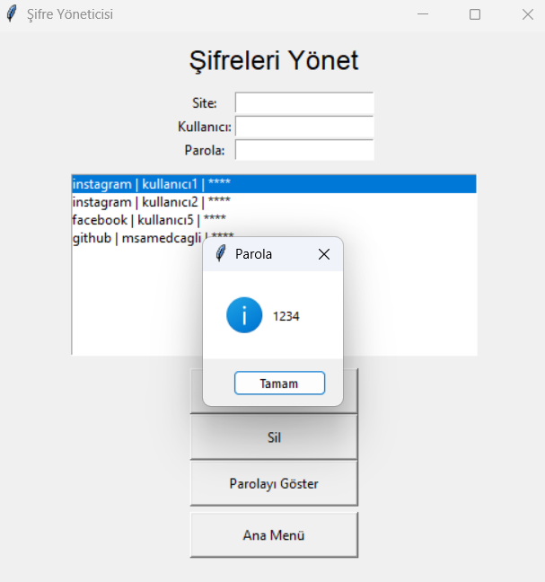

## Proje Hakkında

Kullanıcı dostu arayüzüyle şifrelerini güvenle saklar,<br>
Sadece senin belirlediğin klasöre, tek dosyada şifrelenmiş olarak kaydeder.<br>
Yanlış denemelerde veya şifreni unuttuğunda, sistem tüm verileri güvenle temizler,<br>
Geleneksel sağlamlığa modern güvenliği harmanlar.

---
## Uygulama İçi Görseller
|        Kurulum(Dosya Seçimi)         |       Kurulum(Şifre Belirleme)            |                  Giriş                  |
| :----------------------------------: | :---------------------------------------: |:---------------------------------------:|
|               |                   |                    |
|                 Ana Menü             |              Şifre Oluşturucu             |            Şifreleri Yönet              |
|               |            |              |


---
## Özellikler

- **Master şifre koruması:** Uygulamayı açmak için bir anahtar seç,  
  bu anahtarla tüm şifrelerin korunur.  
- **Şifrelerin saklanması:** Seçtiğin klasörde `.dat` dosyasına gizlenir,  
  başka yerde aranmaz, güvenlikte kalır.  
- **Sadece seçili şifre görünür:** Listede şifreler yıldızlarla gizlenir,  
  parolayı görmek için sadece o şifreyi seçmen yeterlidir.  
- **Şifremi unuttum ve deneme hakkı:** Hakkın bittiğinde veya unuttuğunda,  
  sistem seni sıfırlama kapısına götürür ve tüm gizli dosyaları temizler.  
- **Güçlü şifreleme:** Cryptography modülü ile şifrelerin güçlü bir zırhla korunur.  
- **Kolay kullanım:** Minimum karmaşa, maksimum güvenlik.

---

## Kurulum
1. dist.zip dosyası içerisindeki exe'yi çalıştır.

## VS Code Kurulumu
1. Python 3.10+ yüklü olmalı.  
2. Gerekli modülleri yükle:

    ```bash
    pip install cryptography
    ```

3. Uygulamayı çalıştır:

    ```bash
    python main.py
    ```

4. İlk çalıştırmada, şifrelerin saklanacağı klasörü seç ve master şifreni oluştur.

---

## Kullanım

- Uygulama açıldığında master şifreyi girerek sisteme eriş.  
- Şifreleri listele, ekle, güncelle veya sadece seçili olanın parolasını gör.  
- Şifremi unuttum seçeneği ile sıfırlama işlemini başlatabilirsin.  
- Deneme hakkın bittiğinde sistem otomatik sıfırlar.

---

